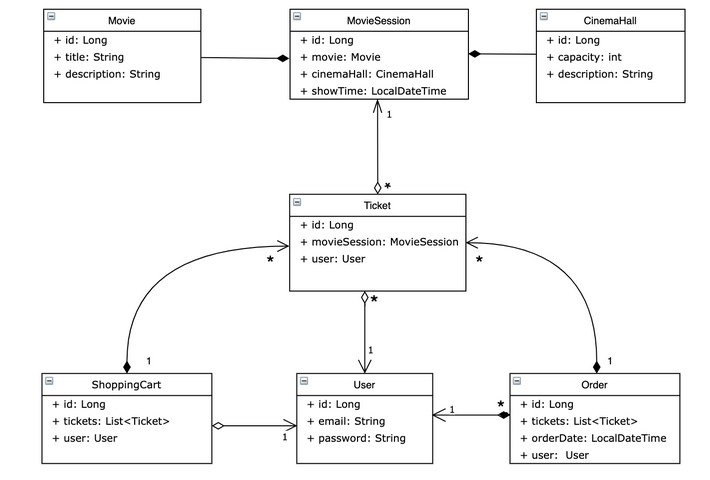

## About this project
In this project I want to show my skills in Java, Hibernate, Spring core Spring Web and Spring 
Security.

Completed structure of project is described below



- Configure role access to specific resources for `ADMIN` and for `USER` looks like.
```
POST: /register - all
GET: /cinema-halls - user/admin
POST: /cinema-halls - admin
GET: /movies - user/admin
POST: /movies - admin
GET: /movie-sessions/available - user/admin
POST: /movie-sessions - admin
PUT: /movie-sessions/{id} - admin
DELETE: /movie-sessions/{id} - admin
GET: /users/by-email - admin
PUT: /shopping-carts/movie-sessions - user
GET: /shopping-carts/by-user - user
GET: /orders - user
POST: /orders/complete - user
``` 
~~~
*Firstly, in this application already exist
two users
  Username "vlad@gmail.com" Password "1234" with role ADMIN
  Username "user@gmail.com" Password "1234" with role USER
  Yoy can register new users using Post method to url /register with body like
  {
    "email": "UserName@Gmail.com",
    "password": "1234",
    "repeatPassword": "1234"
  }

  You also can receive user create Get method to url /users/by-email?email=vlad@gmail.com
  You should have role ADMIN
~~~
~~~
* You can add new Movie using Post method to url /movies with body like
  {
  "title": "Name of Movie",
  "description": "About this movie"
  }
  You should have role ADMIN 

  You also can receive all movies create Get method to url /movies
  You should have role ADMIN or USER
~~~
~~~
* You can add new CinemaHall using Post method to url /cinema-halls with body like
  {
  "capacity": 100,
  "description": "About this Hall"
  }
  You should have role ADMIN

  You also can receive all cinema halls create Get method to url /cinema-halls
  You should have role ADMIN or USER
~~~
~~~
* You can add new Movie Sessions using Post method to url /movie-sessions with body like
  {
  "movieId": 1,
  "cinemaHallId": 1,
  "showTime": "20.11.2021 17:00"
  }
  You should have role ADMIN

  You also can update Movie Session create Put method to url /movie-sessions/{id} with body like
  {
  "movieId": 2,
  "cinemaHallId": 1,
  "showTime": "20.11.2021 20:00"
  }
  You should have role ADMIN

  You also can delete Movie Session create Delete method to url /movie-sessions/{id}
  You should have role ADMIN

  You also can receive all available Movie Session create Get method to url 
  /cinema-halls/available?movieId=1&date=20.11.2021
  You should have role ADMIN or USER
~~~
~~~
* You can add new Movie Sessions using (Ticket) to your Shopping-Cart create Put method to url
  /shopping-carts/movie-sessions?movieSessionId=1
  You should have role USER

  You also can receive information from your Shopping-Cart create Get method to url
  /shopping-carts/by-user
  You should have role USER
~~~
~~~
* You can complete your Order create Post method to url /orders/complete
  You should have role USER

  You also can receive information about your Orders create Get method to url /orders
  You should have role ADMIN or USER 
~~~
~~~


 


*Inside the application, you can create new Drivers, Manufacturers, Cars, and add Drivers to Cars.
*You can also view list of existing Drivers, Manufacturers, and Cars.
*You can delete Drivers, Manufacturers, and Cars.
*Application doesn't allow you to create Drivers with same License Numbers 
(License Number must be in particular format) or Manufacturers with same names.
~~~    
You can test the application by using the following url
[https://tranquil-eyrie-87870.herokuapp.com/](https://tranquil-eyrie-87870.herokuapp.com/)

## Technologies which I used
Project is created with:
```
* Java 11
* MySQL
* Maven
* Hibernate
* Spring (Core, Web, Security)
* Tomcat 9.0.50 (to run app locally. But you can run this app without installing Tomcat, see below)
```

## Setup
You should install MySQL or another DB

Fork this project and clone it.

Now there is dependency "MySQL DB" in `pom.xml`.
~~~
<dependency>
    <groupId>mysql</groupId>
    <artifactId>mysql-connector-java</artifactId>
    <version>8.0.22</version>
</dependency>
~~~
If you have another DB, you should change this dependency to better fit your DB.

Also, in the file `src/main/resources/db.properties` you should fill correct values in these fields
~~~
    db.driver = "**DRIVER_NAME**";
    db.url = "**URL**";
    db.user = "**USER**";
    db.password = "**PASSWORD**";
~~~

We can run this application without installing Tomcat by using next command
~~~
mvn clean package
java -jar target/dependency/webapp-runner.jar target/*.war
~~~


